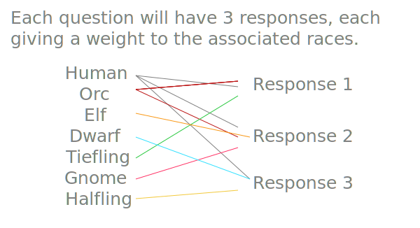
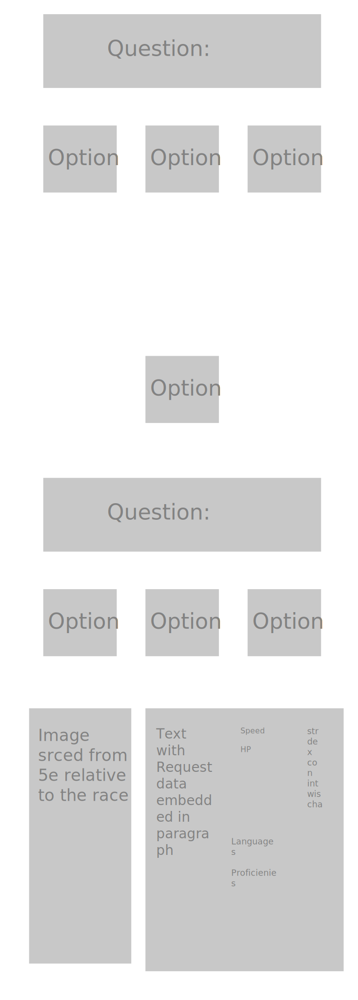

#DND for the Uninitiated

### Premise

Take a quiz to fabricate your 5e character. An entry point for those who get intimated by traditional character sheets.

### Proposed Technology 

- React
- material.io (for style)
- axios requests
- dnd 5e api: https://www.dnd5eapi.co/docs/#races-section

- Question: is react router an absolute must?
    (the following use of router wouldn't be MVP ):
      - router for navigating to different quizzes (classes, subclasses, background, alignment)
      - (since I'm not sure how context works: context to travel the previous quiz result to build the generated section)

### MVP

Start off with core 5e races as the result of quiz questions. Answers will be given a trivial point weight. At the end of the quiz, it result in an end for the base url to begin requests. The fetches are as follows:

- name of race
- speed
- ability bonuses
- typical alignment
- age
- size
- size description
- proficiencies 
- language and their descriptions
- traits
- subraces (link to another quiz [not MVP])

### Stretch Goals

Using router to go to different quizzes, I would want to work with classes.

Rolling base stats and max HP.

Firebase for users to return to their results.  **this one super stretch (writing it down for my personal record of where to continue on this).

### Pedagogy

__Should there be a tie of weight, it will be randomly chosen__

### Wireframe

### Timeframe

__Tuesday__  
`Proposal approval. Component building. Solidifying familiarity with the api.` 
__Wednesday__ 
`Quiz questions and the relative axios requests. Component building.` 
__Thursday__ 
`Quiz questions and the relative axios requests. Component building.` 
__Friday__ 
`Quiz questions and the relative axios requests. Component building` 
__Saturday__ 
`Styling paths and getting as close to wireframe as possible` 
__Sunday__ 
` Find hard stop. Stress test paths and results. Submit` 

